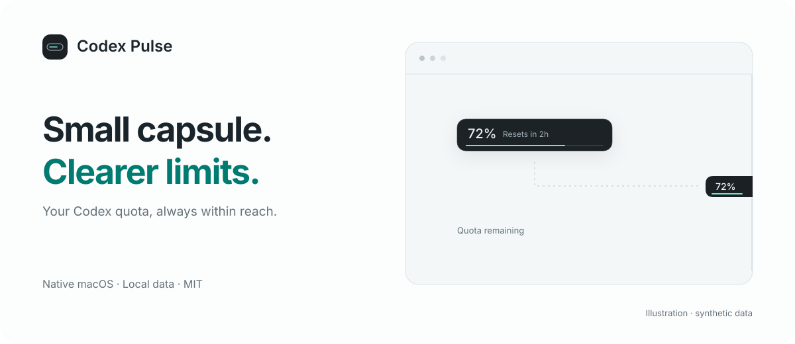

<p align="center"></p>

<p align="center"><a href="https://github.com/Roland0511/codex-pulse/releases/latest"><strong>macOS releases</strong></a> · <a href="README.zh-CN.md">简体中文</a> · <a href="docs/USAGE.en.md">User guide</a> · <a href="https://github.com/Roland0511/codex-pulse/issues">Feedback</a></p>

<p align="center">  <a href="LICENSE"></a> </p>

Codex Pulse keeps your **remaining Codex quota and reset countdown** within reach, in a small floating capsule. Drag it to either screen edge, pin it open when you need it, and get back to your work.

Built with SwiftUI and AppKit. Quota comes from the official local Codex App Server. The app does not read your conversations.

## A little presence, useful detail

| At a glance | When you need more |
| --- | --- |
| **A thin quota line.** Remaining percentage and reset countdown. | **Every available window.** Click for reset times and the latest successful update. |
| **Dock and pin.** Edge attachment, hover expansion, and a pin to keep it open. | **Your colors.** Follow Codex appearance or choose system, light, or dark. |
| **Work in motion.** An optional light trace follows confirmed Codex activity. | **Your language.** English and Simplified Chinese, switchable in Settings. |

Idle stays still. Work animation is clipped to the filled quota line, pauses for approvals, and respects Reduce Motion. Missing values stay unknown; failed or stale readings are labeled.

## Get started

**Signed v0.1.1 downloads are pending notarization.** The bilingual app is available to [build from source](#build-it-yourself) now. Only fully verified packages will be attached to Releases.

1. Install and sign in to the official **Codex** app or CLI.
2. Download the Universal DMG from [Releases](https://github.com/Roland0511/codex-pulse/releases/latest).
3. Drag **Codex Pulse.app → Applications**, eject the disk image, and open the app.

Release DMG and ZIP files are Developer ID signed, notarized by Apple, and stapled. Check downloads against the release's `SHA256SUMS.txt`.

**Requires macOS 14+.** Universal builds include Apple Silicon and Intel. Runtime verification has been performed on Apple Silicon; Intel and older macOS versions still need real-device coverage.

| Action | How |
| --- | --- |
| Show / hide | `⌃⌥⌘P`, configurable in Settings |
| Quota details | Click the capsule, or menu → **Show quota details** |
| Close details | `Escape` or click outside |
| Keep an edge bar open | Click the pin |
| Move without dragging | Menu → **Position** |
| Change language | Settings → **Language** → Follow system / 简体中文 / English |

### Optional work animation

Open **Settings → Work animation**, review the definitions, then install. In Codex CLI, use `/hooks` to review and trust all **12** Pulse definitions. Return to Pulse and choose **Check connection**.

The hooks send lifecycle metadata to a local socket. Existing hooks are preserved and backed up. Turning the feature off removes only Pulse handlers. Nothing is installed automatically. [How it works →](docs/USAGE.en.md#work-animation)

Low quota alerts and launch at login are also **off by default**. Notification permission is requested only when you enable alerts.

## Privacy you can inspect

- **Local quota access.** Authentication stays with the official service. Pulse does not parse tokens or browser cookies.
- **No conversation reader.** No chat logs, prompts, tool arguments, or replies are collected. The helper skips content and sends only allowlisted status metadata and hashed identifiers locally.
- **No Pulse backend or analytics.** Snapshots stay in memory. Preferences, hook backups, and alert deduplication stay on your Mac.
- **No account actions.** Pulse does not reset quota, buy credits, sign you out, or control agents.

Following Codex appearance reads a small allowlist of theme settings. Enabling work animation explicitly changes local hook configuration; quota reading itself is read-only.

## Build it yourself

You need Swift 6+, Xcode Command Line Tools, and Python 3. Installed release apps do not need these tools.

```sh
git clone https://github.com/Roland0511/codex-pulse.git
cd codex-pulse
swift test
python3 scripts/build_app.py
open "dist/Codex Pulse.app"
```

This produces an **ad-hoc signed development app**, not a notarized release. See the [English build guide](docs/BUILD.en.md) or [中文分发说明](docs/DISTRIBUTION.md) for Developer ID packaging.

Translations live in `Resources/Localization/`. After editing them, run `python3 scripts/generate_localizations.py`; `--check` detects missing keys, mismatched placeholders, and generated-table drift.

## Explore and contribute

[English user guide](docs/USAGE.en.md) · [中文使用指南](docs/USAGE.zh-CN.md) · [Design](docs/DESIGN.md) · [Plan](docs/V0.1-PLAN.md) · [Verification](docs/VERIFICATION.md) · [Contributing](CONTRIBUTING.md) · [Security](SECURITY.md)

The first release focuses on one account's quota capsule. Dashboards, conversation browsing, agent controls, and multi-service aggregation are outside its scope. Local Codex protocols may change; compatibility reports with your app and Codex versions are welcome.

## Credits and license

Inspired by [QuotaView](https://github.com/Duoasa/QuotaView) and [Codex Monitor](https://github.com/jackiemingnew/codex-monitor-macos). Their README structures informed the feature, setup, and privacy sections; Pulse's implementation and artwork are independently authored.

[MIT](LICENSE) © 2026 Roland0511. An independent community project, not affiliated with or endorsed by OpenAI. Product names belong to their respective owners.
