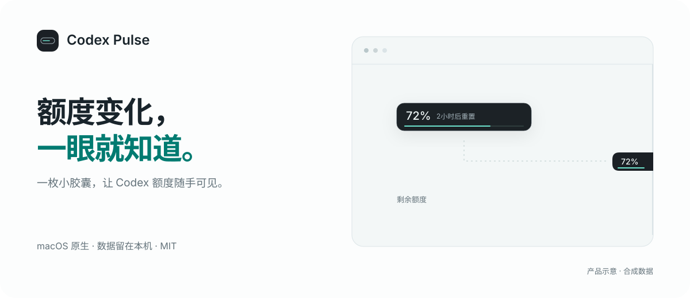

<p align="center"></p>

<p align="center"><a href="https://github.com/Roland0511/codex-pulse/releases/latest"><strong>下载 macOS 版</strong></a> · <a href="README.md">English</a> · <a href="docs/USAGE.zh-CN.md">使用指南</a> · <a href="https://github.com/Roland0511/codex-pulse/issues">问题反馈</a></p>

<p align="center">  <a href="LICENSE"></a> </p>

Codex Pulse 把 **Codex 剩余额度和重置倒计时**，放进一枚随手可见的小胶囊。拖到屏幕边缘自动吸附，需要时用图钉固定展开，平时安静地待在一旁。

使用 SwiftUI 与 AppKit 原生构建，通过官方本地 Codex App Server 读取额度，不读取聊天内容。

## 轻巧，但该知道的都在

| 一眼可见 | 按需展开 |
| --- | --- |
| **一条细额度线。** 剩余百分比与重置倒计时。 | **所有可用额度窗口。** 点击查看准确重置时间及最后成功更新时间。 |
| **吸附与图钉。** 两侧贴边、悬停伸缩，一键固定长条。 | **熟悉的配色。** 自动跟随 Codex，也可选择系统、浅色或深色。 |
| **工作时轻轻流动。** 可选细线流光提示已确认的工作状态。 | **中英双语。** 默认跟随系统，设置中即时切换简体中文和 English。 |

空闲时保持静止。流光限制在额度线的已填充范围，等待审批时暂停，并尊重系统「减少动态效果」。缺失值保持未知，异常或过期读数明确标记。

## 三步开始

1. 安装并登录官方 **Codex** 应用或 CLI。
2. 从 [Releases](https://github.com/Roland0511/codex-pulse/releases/latest) 下载并打开通用架构 DMG。
3. 将 **Codex Pulse.app 拖入 Applications**，弹出磁盘映像后启动。

应用及 DMG 已完成 **Developer ID 签名、Apple 公证及票据附加**，最终容器独立验证通过。也提供 ZIP，使用 `SHA256SUMS.txt` 核对下载文件。

**要求 macOS 14+。** 通用架构包含 Apple Silicon 和 Intel；当前实机验证在 Apple Silicon 上完成，Intel 与旧版 macOS 的实机覆盖仍待补充。

| 想做什么 | 如何操作 |
| --- | --- |
| 显示 / 隐藏 | 默认 `⌃⌥⌘P`，可在设置中修改 |
| 查看详情 | 点击胶囊，或菜单「展开额度详情」 |
| 收起详情 | `Escape` 或点击外部 |
| 固定贴边长条 | 点击图钉 |
| 不拖动也能移动 | 菜单「位置」 |
| 切换语言 | 设置 → 语言 → 跟随系统 / 简体中文 / English |

### 可选工作特效

打开「**设置 → 工作特效**」，审阅定义后安装；在 Codex CLI 输入 `/hooks`，审阅并信任 Pulse 的全部 **12 条**定义，再回到设置点击「检查连接」。

钩子仅把生命周期元数据发到本机 socket，保留其它钩子并备份。关闭功能只移除 Pulse 的 handlers，首次启动不会自动安装。[了解接入步骤 →](docs/USAGE.zh-CN.md#工作特效)

低额度提醒和开机启动也**默认关闭**，只有主动启用提醒时才申请系统通知许可。

## 隐私边界，源码可查

- **额度在本机读取。** 认证交由官方服务处理；Pulse 不解析令牌或浏览器 Cookie。
- **不读取对话。** 不收集聊天日志、提示词、工具参数或回复。helper 跳过正文，只向本机发送白名单状态字段及哈希标识。
- **没有 Pulse 后端或统计上报。** 额度快照只保存在内存中；偏好、钩子备份和提醒去重记录留在本机。
- **不修改账户。** 不执行额度重置、购买积分、登出或代理控制。

选择跟随 Codex 配色时，只读外观设置的少量白名单字段。启用工作特效会在你确认后修改本地 hooks 配置；额度读取本身为只读操作。

## 从源码构建

需要 Swift 6+、Xcode Command Line Tools 和 Python 3。使用正式安装包无需这些工具。

```sh
git clone https://github.com/Roland0511/codex-pulse.git
cd codex-pulse
swift test
python3 scripts/build_app.py
open "dist/Codex Pulse.app"
```

该命令生成 **ad-hoc 签名的开发包**。Developer ID 正式签名与公证流程见[中文分发说明](docs/DISTRIBUTION.md)及 [English build guide](docs/BUILD.en.md)。

翻译集中在 `Resources/Localization/`。修改后运行 `python3 scripts/generate_localizations.py`；`--check` 检查缺失键、占位符和生成表漂移。

## 进一步了解与参与

[中文使用指南](docs/USAGE.zh-CN.md) · [English user guide](docs/USAGE.en.md) · [设计约定](docs/DESIGN.md) · [实施计划](docs/V0.1-PLAN.md) · [验证记录](docs/VERIFICATION.md) · [参与贡献](CONTRIBUTING.md) · [安全报告](SECURITY.md)

首版专注单账户额度胶囊，不扩展为任务仪表盘、对话浏览器、代理控制台或多服务聚合器。Codex 本地协议可能随版本变化，欢迎附上应用与 Codex 版本反馈兼容性问题。

## 致谢与许可

参考了 [QuotaView](https://github.com/Duoasa/QuotaView) 与 [Codex Monitor](https://github.com/jackiemingnew/codex-monitor-macos) 的产品思路及 README 的功能、上手、隐私叙述方式。Pulse 的实现和图稿独立编写。

[MIT](LICENSE) © 2026 Roland0511。Codex Pulse 是独立社区项目，与 OpenAI 无隶属或背书关系；产品名称归各自所有者所有。
